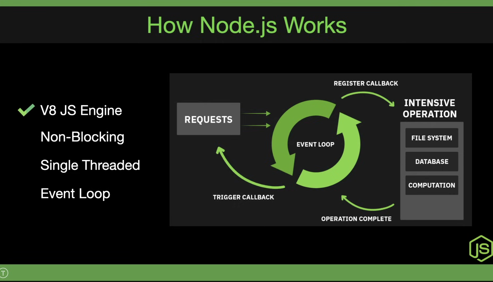

> ## General Goals
### Modules
### Event Loop
### Asynchronous Programming

# Node.js YT Course:
<!-- https://www.youtube.com/watch?v=32M1al-Y6Ag&t=0s -->

- What is node.js, how does it work
- installation, setup, package.json, npm
- custom modules, CommonJS, ES Modules
- HTTP module, req/res, routing, serving JSON/HTML
- custom middleware

# What is node.js and how it works:

- a js runtime, its a program that runs other programs
- nodejs is fast and scalable
- Node runs on the V8 js engine (which is same as the one in chrome), which is implemented in c++
- Non-blocking: doesn't wait around for completion of I/O ops(network calls, file system ops, db ops), and instead of blockign the exec of code while waiting for these thigns to complete, node uses events and callbacks

- single threaded, uses an event loop which allows it to perform non blocking io ops, when you make a network call, it doesn't wait for it to complete instead it continues to exec the rest of the code and when that req does complete it triggers a callback which is then added to event queue and the event loop picks up the callback and executes it.

## what node is used for
- building APIs
- server-rendered apps
- real time apps like chat, games, collaboration tools
- microservices
- cmd line tools
- bots, twitter bots
- web scraping
- web servers, complex routing, dynamic content

> ❌ Not good for cpu intensisve tasks

## installation and usage
- node js comes with a REPL - read eval print loop, basically command line environment to run node
### new node project
> `npm init` or `npm init -y` to skip questions
- in node.js there is no window and document object because these are part of the browser, instead we have the global and process objects which contains functions like setTimeout, setInterval, these are not part of JS, they are part of the browser's web APIs, and are also available to node, there is no document object because there is DOM, as the document object pertains to the dom, but there is a process object which pertains to the current process which contains things env vars etc.
- so basically the environment is differnt but the language is the same.

## Modules
- you can export objects, arrays, functions, or other types of data.
### 1. First using `CommonJS` - the native node js module system
> Below is a default import example, only one thing being exported so you can just import it into one variable inside index.js
> `utils.js`
```js
function generateRandom() {
    return Math.floor(Math.random() * 100) + 1;
}

module.exports = generateRandom;
```
> `index.js`
```js
const generateRandom = require('./utils');

console.log(`random number between 1 and 100: ${generateRandom()}`);
```
> Multiple exports and imports
> `utils.js`
```js
function generateRandom() {
    return Math.floor(Math.random() * 100) + 1;
}

function isPrime(x) {
    for(let i=2;i <= Math.sqrt(x);i++) {
        if(x % i == 0) return false;
    }
    return true;
}

module.exports = {
    generateRandom, isPrime
};
```
> `index.js`
```js
const {generateRandom, isPrime} = require('./utils');

let x = generateRandom();
console.log(`random number between 1 and 100: ${x} and its ${isPrime(x) ? "a": "not a"} prime number.`);
```
### 2. ES syntax
to use es module syntax, in the package.json add: `"type":"module"`, there are two options `commonjs` and `module`

```js
const posts = [
    {id:1 , title: 'Post 1'},
    {id:2, title: 'Post 2'}
];
```
> first way to export
```js
export const getPosts = () => posts;
// then in index.js
import { getPosts } from './postController.js';   // .js is important else error
```
> or
```js
const getPosts = () => posts;
export { getPosts };
// and
import { getPosts } from './postController.js';   // .js is important else error
```

> or export it as default so you can import one thing which will by default be whatever was default
> can only have one default export
```js
const getPosts = () => posts;
export default getPosts;
```
> or you might want to export one thing as a default and then others as non defaults
> so consider
```js
const getPosts = () => posts;
export const getPostsLength = () => posts.length;

export default getPosts;
// so this will export getPosts as default and getPostsLength as custom and these can be imported like so:
import getPosts, { getPostsLength } from './postController.js';
```

# `http` module
``js
import http from 'http';
const PORT = 8000;

const server = http.createServer((req, res) => {
    // res.setHeader('Content-Type', 'text/html');
    // res.statusCode = 404;
    // or
    
    // res.write('<h1>h</h1>')
    // res.write('<h1>h</h1>')
    // res.end(`<span style='color:red;'>hello</span>`);

    res.writeHead(500, {'Content-Type': 'application/json'});
    res.end(JSON.stringify({message:'Server crashed.'}));
})

server.listen(PORT, () => {
    console.log(`Server, running on ${PORT}`)
})
```

### `package.json` > scripts:
- inside scripts you can write two types of scripts:
    - ones that are either `start` or `test`, these can be invoked like so: `npm` `start`/`test`
    - anything other than `start`/`test`, like `dev`, these can be invoked like so: `npm run dev`

### installing a module:
- `npm i -D nodemon`: installs as a dev dependecy, which are dependencies not needed for prod env.

- after installing, the `node_modules` folder will contain the installed module, the `package.json` will have the new project dependency under "dependencies" or 'devDependencies' key and the `package-lock.json` file which contains the entire dependency tree will be updated.
- you dont want to or need to push node_modules to github as one can just do `npm i` which will check the package.json manifest file and install all the dependencies easily.

### use `nodemon`:
- inside package.json scripts: "start": "node server.js" -> "start": "nodemon server.js"

### `.env` file and env variables
- env variables are variables that are on your env, on your system, you can access them from the entire program, we can access them using different prog languages, with node.js we have the globally available `process` object that is a env object with all the env var, you can create a `.env` file and have your env variables in it and the process object will pick them up.
- shouldn't push .env to github
- update scripts: "start": "nodemon --env-file=.env server.js"
- in server.js, `const PORT = process.env.PORT;`

### `http` `req` object
```js
const server = http.createServer((req, res) => {
    // res.setHeader('Content-Type', 'text/html');
    // res.statusCode = 404;
    // // or
    
    // res.write('<h1>h</h1>')
    // res.write('<h1>h</h1>')
    // res.end(`<span style='color:red;'>hello</span>`);

    console.log(req.url);
    console.log(req.method);

    res.writeHead(500, {'Content-Type': 'text/html'});
    res.end('<h1>hello</h1>');
})
```
- `console.log(req.url);`:
    - `/` for localhost:8000
    - `/about` for localhost:8000/about
- `console.log(req.method);`: `GET` default, for any page

### creating a simple router using http module:
```js
import http from 'http';
const PORT = process.env.PORT;

const server = http.createServer((req, res) => {
    if (req.url === '/') {
        res.writeHead(200, {'Content-Type': 'text/html'});
        res.end('<h1>home page</h1>');
    } else {
        res.writeHead(200, {'Content-Type': 'text/html'});
        res.end('<h1>not home page</h1>');
    }

    // res.writeHead(500, {'Content-Type': 'text/html'});
    // res.end('<h1>hello</h1>');
})

server.listen(PORT, () => {
    console.log(`Server, running on ${PORT}`)
})
```
```js
const server = http.createServer((req, res) => {
    try {
        if (req.method === 'GET') {
            if (req.url === '/') {
                res.writeHead(200, {'Content-Type': 'text/html'});
                res.end('<h1>home page</h1>');
            } else {
                res.writeHead(200, {'Content-Type': 'text/html'});
                res.end('<h1>not home page</h1>');
            }
        } else {
            // res.write('not get request\n');
            throw new Error('method not allowed');
        }
    } catch (error) {
        res.writeHead(500, {'Content-Type': 'text/plain'});
        res.end('Server Error');
        console.log("ERROR is", error);
    }
})
```
### loading files
- `fs` module, multiple ways to read files:
    - default async callback
    - synchronous version, which is blocking it stops your program until the file is read, not preferred.
    - promise version, either with .then or async/await, preferred
        - `import fs from 'fs/promises'
> ### Get the path of the current  file
```js
import url from 'url';
const __filename = url.fileURLToPath(import.meta.url);  // import.meta.url is the url of this file and it gets converted to a path
```
> ### Get the path of the current dir
```js
import path from 'path';
const __dirname = path.dirname(__filename);
```
> ### to read a file's data:
1. first make the method `async` as the fs.readFile() requires await as its a promise based file read
2. get the filePath:
```js
import path as 'path';
let filePath = path.join(__dirname, 'public', `index.html`);    // something like this
```
3. `const data = await fs.readFile(filePath);`
4. then use the data, `res.write(data);`

this is the complete example:
```js
const server = http.createServer(async (req, res) => {
    try {
        if (req.method === 'GET') {
            let filePath;
            if (req.url === '/') {
                filePath = path.join(__dirname, 'public', 'index.html');
            }
            else if(req.url === '/about'){
                filePath = path.join(__dirname, 'public', 'about.html');
            } else {
                throw new Error('route/page not found.');
            }
            const data = await fs.readFile(filePath);
            res.setHeader('Content-Type', 'text/html');
            res.write(data);
            res.end();
        } else {
            // res.write('not get request\n');
            throw new Error(`${req.method} not allowed`);
        }
    } catch (error) {
        res.writeHead(500, {'Content-Type': 'text/html'});
        let filePath = path.join(__dirname, 'public', 'fallback.html');
        const data = await fs.readFile(filePath);
        res.end(data);
        console.log("ERROR is", error);
    }
})
```

## important points/methods thus far:
- `import http from 'http';
- `const server = http.createServer((req, res) => {})`
- `server.listen(port, () => {console.log('running')})`
- `req.url`, `req.method`
- `res.write(data)` and `req.end(data)`
- `req.setHeader('Content-Type', 'application/json or text/plain or text/html');`
- `res.statusCode = 404;`
- `req.writeHeader(statusCode, {'Content-Type':'text/plain'});`
- `const filePath = path.join(__dirname, 'public', 'index.html')`
- `async (req, res) => {..., const data = await fs.readFile(filePath);}`
- `res.end()` is important otherwise your server wont return the response and you'll be waiting endlessly
- If you want to perform different async opertions but in order then await them in a new async function, see fsDemo.js for example

### rest api, see `server2.js`

### middleware
> basically modules or functions that have access to the request and response objects, because they sit in the middle of incoming requests and outgoing responses, and they can execute any code that you want, they can also make changes to the req and res objects
> often times we have authentication middleware, we might have access to res.user for the logged in user
> you call the next middleware using next() function

> see `server2.js`

### `fs` module:
1. `readFile()`
2. `writeFile()`
3. `appendFile()`

### `path` module:
- it gives you utilities to work with paths
- it doesn't matter if its the current path or a real paths, this module helps you work with path values

