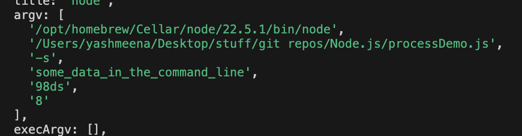
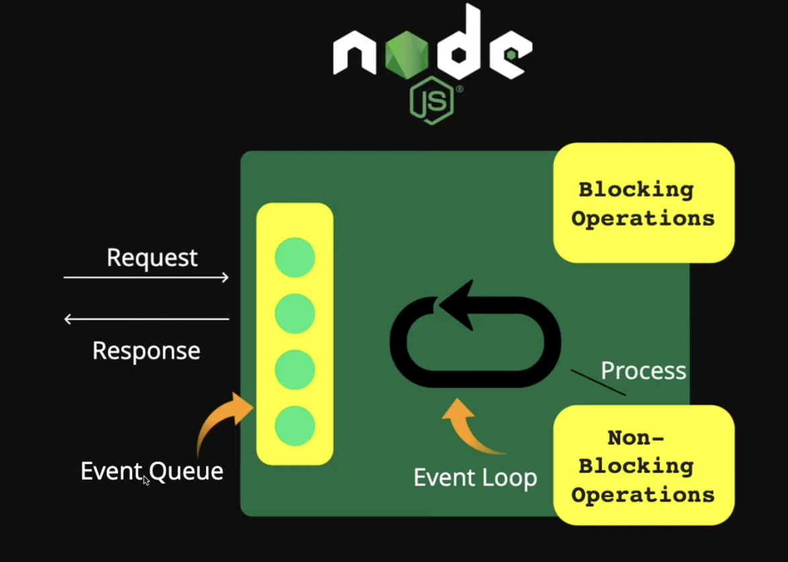
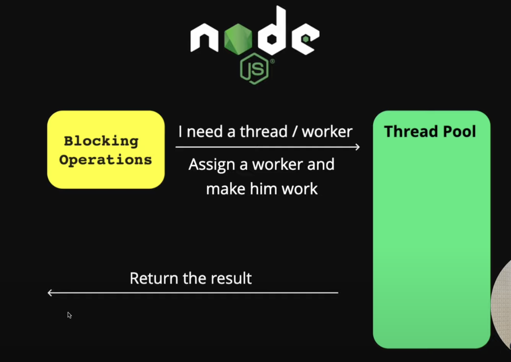
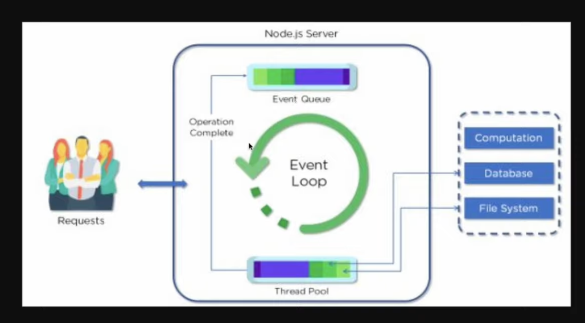
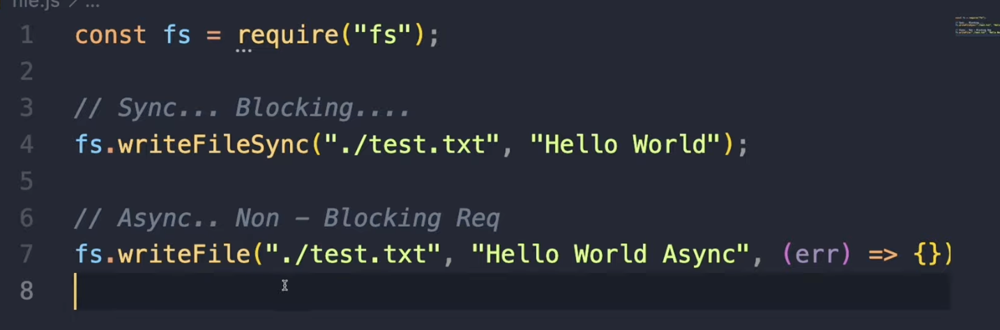

> ## General Goals
### Modules
### Event Loop
### Asynchronous Programming

# Node.js YT Course:
<!-- https://www.youtube.com/watch?v=32M1al-Y6Ag&t=0s -->

- What is node.js, how does it work
- installation, setup, package.json, npm
- custom modules, CommonJS, ES Modules
- HTTP module, req/res, routing, serving JSON/HTML
- custom middleware

# What is node.js and how it works:

- a js runtime, its a program that runs other programs
- nodejs is fast and scalable
- Node runs on the V8 js engine (which is same as the one in chrome), which is implemented in c++
- Non-blocking: doesn't wait around for completion of I/O ops(network calls, file system ops, db ops), and instead of blockign the exec of code while waiting for these thigns to complete, node uses events and callbacks

- single threaded, uses an event loop which allows it to perform non blocking io ops, when you make a network call, it doesn't wait for it to complete instead it continues to exec the rest of the code and when that req does complete it triggers a callback which is then added to event queue and the event loop picks up the callback and executes it.

## what node is used for
- building APIs
- server-rendered apps
- real time apps like chat, games, collaboration tools
- microservices
- cmd line tools
- bots, twitter bots
- web scraping
- web servers, complex routing, dynamic content

> ❌ Not good for cpu intensisve tasks

## installation and usage
- node js comes with a REPL - read eval print loop, basically command line environment to run node
### new node project
> `npm init` or `npm init -y` to skip questions
- in node.js there is no window and document object because these are part of the browser, instead we have the global and process objects which contains functions like setTimeout, setInterval, these are not part of JS, they are part of the browser's web APIs, and are also available to node, there is no document object because there is DOM, as the document object pertains to the dom, but there is a process object which pertains to the current process which contains things env vars etc.
- so basically the environment is differnt but the language is the same.

## Modules
- you can export objects, arrays, functions, or other types of data.
### 1. First using `CommonJS` - the native node js module system
> Below is a default import example, only one thing being exported so you can just import it into one variable inside index.js
> `utils.js`
```js
function generateRandom() {
    return Math.floor(Math.random() * 100) + 1;
}

module.exports = generateRandom;
```
> `index.js`
```js
const generateRandom = require('./utils');

console.log(`random number between 1 and 100: ${generateRandom()}`);
```
> Multiple exports and imports
> `utils.js`
```js
function generateRandom() {
    return Math.floor(Math.random() * 100) + 1;
}

function isPrime(x) {
    for(let i=2;i <= Math.sqrt(x);i++) {
        if(x % i == 0) return false;
    }
    return true;
}

module.exports = {
    generateRandom, isPrime
};
```
> `index.js`
```js
const {generateRandom, isPrime} = require('./utils');

let x = generateRandom();
console.log(`random number between 1 and 100: ${x} and its ${isPrime(x) ? "a": "not a"} prime number.`);
```
### 2. ES syntax
to use es module syntax, in the package.json add: `"type":"module"`, there are two options `commonjs` and `module`

```js
const posts = [
    {id:1 , title: 'Post 1'},
    {id:2, title: 'Post 2'}
];
```
> first way to export
```js
export const getPosts = () => posts;
// then in index.js
import { getPosts } from './postController.js';   // .js is important else error
```
> or
```js
const getPosts = () => posts;
export { getPosts };
// and
import { getPosts } from './postController.js';   // .js is important else error
```

> or export it as default so you can import one thing which will by default be whatever was default
> can only have one default export
```js
const getPosts = () => posts;
export default getPosts;
```
> or you might want to export one thing as a default and then others as non defaults
> so consider
```js
const getPosts = () => posts;
export const getPostsLength = () => posts.length;

export default getPosts;
// so this will export getPosts as default and getPostsLength as custom and these can be imported like so:
import getPosts, { getPostsLength } from './postController.js';
```

# `http` module
```js
import http from 'http';
const PORT = 8000;

const server = http.createServer((req, res) => {
    // res.setHeader('Content-Type', 'text/html');
    // res.statusCode = 404;
    // or
    
    // res.write('<h1>h</h1>')
    // res.write('<h1>h</h1>')
    // res.end(`<span style='color:red;'>hello</span>`);

    res.writeHead(500, {'Content-Type': 'application/json'});
    res.end(JSON.stringify({message:'Server crashed.'}));
})

server.listen(PORT, () => {
    console.log(`Server, running on ${PORT}`)
})
```

### `package.json` > scripts:
- inside scripts you can write two types of scripts:
    - ones that are either `start` or `test`, these can be invoked like so: `npm` `start`/`test`
    - anything other than `start`/`test`, like `dev`, these can be invoked like so: `npm run dev`

### installing a module:
- `npm i -D nodemon`: installs as a dev dependecy, which are dependencies not needed for prod env.

- after installing, the `node_modules` folder will contain the installed module, the `package.json` will have the new project dependency under "dependencies" or 'devDependencies' key and the `package-lock.json` file which contains the entire dependency tree will be updated.
- you dont want to or need to push node_modules to github as one can just do `npm i` which will check the package.json manifest file and install all the dependencies easily.

### use `nodemon`:
- inside package.json scripts: "start": "node server.js" -> "start": "nodemon server.js"

### `.env` file and env variables
- env variables are variables that are on your env, on your system, you can access them from the entire program, we can access them using different prog languages, with node.js we have the globally available `process` object that is a env object with all the env var, you can create a `.env` file and have your env variables in it and the process object will pick them up.
- shouldn't push .env to github
- update scripts: "start": "nodemon --env-file=.env server.js"
- in server.js, `const PORT = process.env.PORT;`

### `http` `req` object
```js
const server = http.createServer((req, res) => {
    // res.setHeader('Content-Type', 'text/html');
    // res.statusCode = 404;
    // // or
    
    // res.write('<h1>h</h1>')
    // res.write('<h1>h</h1>')
    // res.end(`<span style='color:red;'>hello</span>`);

    console.log(req.url);
    console.log(req.method);

    res.writeHead(500, {'Content-Type': 'text/html'});
    res.end('<h1>hello</h1>');
})
```
- `console.log(req.url);`:
    - `/` for localhost:8000
    - `/about` for localhost:8000/about
- `console.log(req.method);`: `GET` default, for any page

### creating a simple router using http module:
```js
import http from 'http';
const PORT = process.env.PORT;

const server = http.createServer((req, res) => {
    if (req.url === '/') {
        res.writeHead(200, {'Content-Type': 'text/html'});
        res.end('<h1>home page</h1>');
    } else {
        res.writeHead(200, {'Content-Type': 'text/html'});
        res.end('<h1>not home page</h1>');
    }

    // res.writeHead(500, {'Content-Type': 'text/html'});
    // res.end('<h1>hello</h1>');
})

server.listen(PORT, () => {
    console.log(`Server, running on ${PORT}`)
})
```
```js
const server = http.createServer((req, res) => {
    try {
        if (req.method === 'GET') {
            if (req.url === '/') {
                res.writeHead(200, {'Content-Type': 'text/html'});
                res.end('<h1>home page</h1>');
            } else {
                res.writeHead(200, {'Content-Type': 'text/html'});
                res.end('<h1>not home page</h1>');
            }
        } else {
            // res.write('not get request\n');
            throw new Error('method not allowed');
        }
    } catch (error) {
        res.writeHead(500, {'Content-Type': 'text/plain'});
        res.end('Server Error');
        console.log("ERROR is", error);
    }
})
```
### loading files
- `fs` module, multiple ways to read files:
    - default async callback
    - synchronous version, which is blocking it stops your program until the file is read, not preferred.
    - promise version, either with .then or async/await, preferred
        - `import fs from 'fs/promises'
> ### Get the path of the current  file
```js
import url from 'url';
const __filename = url.fileURLToPath(import.meta.url);  // import.meta.url is the url of this file and it gets converted to a path
```
> ### Get the path of the current dir
```js
import path from 'path';
const __dirname = path.dirname(__filename);
```
> ### to read a file's data:
1. first make the method `async` as the fs.readFile() requires await as its a promise based file read
2. get the filePath:
```js
import path as 'path';
let filePath = path.join(__dirname, 'public', `index.html`);    // something like this
```
3. `const data = await fs.readFile(filePath);`
4. then use the data, `res.write(data);`

this is the complete example:
```js
const server = http.createServer(async (req, res) => {
    try {
        if (req.method === 'GET') {
            let filePath;
            if (req.url === '/') {
                filePath = path.join(__dirname, 'public', 'index.html');
            }
            else if(req.url === '/about'){
                filePath = path.join(__dirname, 'public', 'about.html');
            } else {
                throw new Error('route/page not found.');
            }
            const data = await fs.readFile(filePath);
            res.setHeader('Content-Type', 'text/html');
            res.write(data);
            res.end();
        } else {
            // res.write('not get request\n');
            throw new Error(`${req.method} not allowed`);
        }
    } catch (error) {
        res.writeHead(500, {'Content-Type': 'text/html'});
        let filePath = path.join(__dirname, 'public', 'fallback.html');
        const data = await fs.readFile(filePath);
        res.end(data);
        console.log("ERROR is", error);
    }
})
```

## important points/methods thus far:
- `import http from 'http';
- `const server = http.createServer((req, res) => {})`
- `server.listen(port, () => {console.log('running')})`
- `req.url`, `req.method`
- `res.write(data)` and `req.end(data)`
- `req.setHeader('Content-Type', 'application/json or text/plain or text/html');`
- `res.statusCode = 404;`
- `req.writeHeader(statusCode, {'Content-Type':'text/plain'});`
- `const filePath = path.join(__dirname, 'public', 'index.html')`
- `async (req, res) => {..., const data = await fs.readFile(filePath);}`
- `res.end()` is important otherwise your server wont return the response and you'll be waiting endlessly
- If you want to perform different async opertions but in order then await them in a new async function, see fsDemo.js for example

### rest api, see `server2.js`

### middleware
> basically modules or functions that have access to the request and response objects, because they sit in the middle of incoming requests and outgoing responses, and they can execute any code that you want, they can also make changes to the req and res objects
> often times we have authentication middleware, we might have access to res.user for the logged in user
> you call the next middleware using next() function

> see `server2.js`

### `fs` module:
1. `readFile()`
2. `writeFile()`
3. `appendFile()`

### `path` module:
- it gives you utilities to work with paths
- it doesn't matter if its the current path or a real paths, this module helps you work with path values

### `os` module:
- gives info about the sys, you can interact with the cpu, mem of the sys, mem used, etc
### `url` module:
- gives info about the sys, you can interact with the cpu, mem of the sys, mem used, etc

### `EventEmitter`
- you can create custom events and you can listen for them
- great for real-time apps
- you can also listen to built in events like data events on a stream
- the `.on()` method is used to register event listeners, you can listen to multiple events and have multiple listeners for the same event
```js
import { EventEmitter } from "events";

const myEmitter = new EventEmitter();

function greetHandler() {
    console.log('Hello world');
}
function goodbyeHandler(name) {
    console.log('goodbye', name);
}

// register event listeners
myEmitter.on('greet', greetHandler);
myEmitter.on('goodbye', goodbyeHandler);

// emit events
myEmitter.emit('greet');
myEmitter.emit('goodbye', 'john');
```
- this allows you to emit events from anywhere and create real-time applications
- you can also pass data with the events

### `process` obj
- global obj
- it has an argv property which has two values by default:
    <pre>
    argv: [
            '/opt/homebrew/Cellar/node/22.5.1/bin/node',
            '/Users/yashmeena/Desktop/stuff/git repos/Node.js/processDemo.js'
        ],
    </pre>
    - they are the path to node.js and the path to the current file
    - but if you add arguements thru the command line then they will be in `argv`
    - this is helpful when creating CLIs
    - for example:

    `node processDemo.js -s some_data_in_the_command_line '98ds' 8`
    


# 2nd course
# points
- in node window and document are not defined, they are defined in client side js like in the browser
## node module system
### global obj
- console.log, setTimeout() are global objects
- in browsers, `window` represents the global scope, so we can do window.console.log or console.log, the js engine will prefix the statement console.log with window because thats where its defined
- similarly when we define variables, they are defined inside the window obj
- but in node we dont have the window object we have another object called global, so the default stuff like console.log are still accessible like so global.console.log, but if you do var msg = 'txt' then this msg variable isn't accessible through global, the variabels defined in the file are not added to the global object, they are only scoped within the file
- every file in node is a module, everything defined inside the modul like var and funcs are scope limited to that file/module, they are private, to use it outside you need to explicitly export it and make it public.
- console.log(module), only works with commonjs

- to export with commonjs:
```js
module.exports.log = log
module.exports.myUrl = url;
```
- to import use the `require()` fuunction:
```js
const logger = require(./subfolder/logger.js);
logger.log();
```

- to exoprt a single thing:
`module.exports = log;`
then import and call directly


# 3rd course
# node arch, and how it works

- a client makes a request to a node server
- the request gets queuend in the event queue
- then the event loop which is a like a machine that continuously watches the event queue, it picks up the top most request from the queue, the request can be of two typess:
    - blocking ops or synchronous tasks, and
    - non-blocking ops or ansynchronous tasks
- if the req picked by the event loop is a non blocking operation, then it will process it and send the response to the user, else if its a blocking opertation, then to resolve the blocking op, it goes to the thread pool which is a pool of threads (workers), a thread is assigned to each blocking operation, which performs it and returns the result


- we have limited num of threads, by default 4, if all workers are busy, then new blocking operation will need to wait, so its not scalable easily

example:

- max thread pool size depends on your cores on the machine, max 8 for 8 cores

# misc.
## 1. package.json what is it
- The package.json file serves as the manifest for a Node.js project. It defines the project’s metadata, dependencies, and scripts, making it essential for managing the project lifecycle, including installation, testing, and deployment.
- The package.json file ensures consistent installation of dependencies across environments and provides a central place for managing project configuration.
- key fields are:
    - name: of the proj
    - version: of the proj
    - description: of the proj
    - main: entry point for the app
    - scripts: tu run commands
    - dependencies: list of external packages the project relies on
    - devDependencies: list of dev related packages that are not needed for prod
    - engines: node version
    - license: MIT
## middleware:
```js
const express = require('express');
const app = express()

app.use(middleware_func)
or
app.use((req, res, next) => {
    console.log(`${new Date.toLocaleString()} - request received for: ${req.originalUrl}`);
    next();
})
```

## req (Request) Object
The req object represents the incoming HTTP request and contains information about the request that was made by the client. Here are some important properties and methods of the req object:

- `req.method`: The HTTP method used for the request (e.g., 'GET', 'POST', 'PUT', 'DELETE').

- `req.url`: The URL of the request, including the path and query string.

req.originalUrl: The original URL of the request. This is especially useful if your application is using a router and the URL might have been modified.

req.headers: An object containing the headers sent with the request. Headers include metadata like content type, authorization tokens, etc.

req.query: An object containing the parsed query string parameters. For example, for the URL '/search?term=node&sort=asc', req.query would be { term: 'node', sort: 'asc' }.

req.params: An object containing route parameters from the URL. For example, in the route /user/:id, if the URL is /user/123, req.params.id would be '123'.

req.body: Contains data sent in the request body. This is typically used with POST or PUT requests. For parsing JSON bodies, middleware like express.json() is used.

req.cookies: An object containing cookies sent by the client. Cookies are used to store data on the client-side and send it with requests.

req.ip: The IP address of the client making the request.

res (Response) Object
The res object represents the HTTP response that your server will send back to the client. Here are some important properties and methods of the res object:

res.status(code): Sets the HTTP status code for the response. For example, res.status(404) sets the status code to 404 Not Found.

res.send(body): Sends the response body to the client. This could be a string, an object, or any other data.

res.json(data): Sends a JSON response. This method automatically sets the Content-Type header to application/json.

res.sendFile(path): Sends a file as a response. This method is useful for serving static files.

res.redirect([status], path): Redirects the client to a different URL. The optional status code can specify the HTTP status code for the redirection (e.g., 301 for permanent redirection).

res.cookie(name, value, [options]): Sets a cookie on the client. name is the name of the cookie, value is the value to store, and options is an optional object that can specify properties like expiration, path, domain, etc.

res.clearCookie(name, [options]): Clears a cookie by setting its expiration date to the past.

# ways to optimize web apps:
- lazy loading, code splitting, bundling, minification,
- code splitting is when you break your js code into modules and load only what you need asynchronously when you need it.
- react: infinite scrolling and pagination

How would you optimize a Node.js application for performance?
Optimizing a Node.js application for performance involves addressing several key areas:

1. Efficient use of Asynchronous Operations:
Use async/await or Promises for non-blocking operations.
Avoid synchronous methods like fs.readFileSync().
2. Leverage Caching:
Implement caching strategies (e.g., Redis, in-memory caching) to store frequently accessed data.
Cache database query results, static assets, or rendered HTML.
3. Use Streams for Large Data:
Use streams (e.g., fs.createReadStream()) to handle large data files rather than loading entire files into memory.
4. Clustering and Load Balancing:
Use Node.js clustering to take advantage of multi-core processors by creating child processes.
Use load balancers (e.g., NGINX) to distribute requests across multiple instances of your app.
5. Memory Management:
Monitor memory usage and avoid memory leaks by using tools like Node.js heap profiling or --inspect for diagnosing memory-related issues.
6. Compression:
Use Gzip compression to reduce the size of responses (e.g., compression middleware in Express).
7. Optimize Database Queries:
Use connection pooling and indexed queries to reduce database latency.
Use an ORM (e.g., Sequelize) or query optimization tools.
8. Minimize Middleware:
Only use necessary middleware and avoid adding unnecessary overhead.
9. Use HTTP/2:
Leverage HTTP/2 for faster, multiplexed HTTP requests with less overhead.
Optimizing a Node.js app involves improving CPU, memory, I/O, and network performance while using the right tools to track performance bottlenecks


# Resources:
## 1. https://www.linkedin.com/feed/update/urn:li:activity:7241683559839633409/
NodeJS Roadmap

➤ Phase 1 - JavaScript Basics

 𝗝𝗮𝘃𝗮𝗦𝗰𝗿𝗶𝗽𝘁 𝗖𝗼𝗻𝗰𝗲𝗽𝘁𝘀:
 - Lexical Structure
 - Expressions
 - Data Types
 - Classes
 - Variables
 - Functions
 - this Keyword
 - Arrow Functions
 - Loops
 - Scopes
 - Arrays
 - Template Literals

 𝗔𝘀𝘆𝗻𝗰𝗵𝗿𝗼𝗻𝗼𝘂𝘀 𝗣𝗿𝗼𝗴𝗿𝗮𝗺𝗺𝗶𝗻𝗴:
 - Callbacks
 - Timers
 - Promises
 - Async & Await

 𝗖𝗼𝗿𝗲 𝗖𝗼𝗻𝗰𝗲𝗽𝘁𝘀:
 - Closures
 - The Event Loop

➤ Phase 2 - Core NodeJS Concepts

 𝗡𝗼𝗱𝗲𝗝𝗦 𝗙𝘂𝗻𝗱𝗮𝗺𝗲𝗻𝘁𝗮𝗹𝘀:
 - Global Objects in NodeJS (__dirname, __filename, module)
 - Modules (CommonJS Modules and ES6 Modules import/export)
 - NPM (Node Package Manager)

 𝗙𝗶𝗹𝗲 𝗦𝘆𝘀𝘁𝗲𝗺 (𝗳𝘀) 𝗠𝗼𝗱𝘂𝗹𝗲:
 - Reading/Writing Files
 - File Streams
 - Asynchronous vs. Synchronous File Operations

 𝗘𝘃𝗲𝗻𝘁𝘀 & 𝗧𝗵𝗲 𝗘𝘃𝗲𝗻𝘁 𝗘𝗺𝗶𝘁𝘁𝗲𝗿:
 - Custom events
 - Handling asynchronous events

 𝗛𝗧𝗧𝗣 𝗠𝗼𝗱𝘂𝗹𝗲:
 - Creating an HTTP server (Handling req and res)

 𝗕𝘂𝗳𝗳𝗲𝗿 & 𝗦𝘁𝗿𝗲𝗮𝗺𝘀:
 - Buffer: Handling binary data
 - Streams: Readable, Writable, Duplex, and Transform streams
 - Stream handling (piping, chunking)

➤ Phase 3 - Advanced NodeJS Concepts

 𝗘𝘅𝗽𝗿𝗲𝘀𝘀 𝗙𝗿𝗮𝗺𝗲𝘄𝗼𝗿𝗸:
 - Routing
 - Middleware
 - Handling Req, Res & Error 
 - Serving Static Files
 - Template Engines (e.g., Pug, EJS)
 - RESTful APIs

 𝗗𝗮𝘁𝗮𝗯𝗮𝘀𝗲 𝗜𝗻𝘁𝗲𝗴𝗿𝗮𝘁𝗶𝗼𝗻:
 - MongoDB with Mongoose (CRUD operations, Schemas & Models)
 - SQL (MySQL, PostgreSQL)
 - Using Sequelize
 - Redis

➤ Phase 4 - Real-time Applications

 𝗪𝗲𝗯𝗦𝗼𝗰𝗸𝗲𝘁𝘀 𝘄𝗶𝘁𝗵 𝗦𝗼𝗰𝗸𝗲𝘁.𝗶𝗼:
 - Real-time data communication

 𝗘𝘃𝗲𝗻𝘁-𝗗𝗿𝗶𝘃𝗲𝗻 𝗔𝗿𝗰𝗵𝗶𝘁𝗲𝗰𝘁𝘂𝗿𝗲:
 - Understanding event-driven development

➤ Phase 5 - Security Practices

 - Environment Variables & Configuration (.env)
 - Input Validation (Joi)
 - Preventing Common Vulnerabilities (XSS, CSRF, SQL Injection)
 - Authentication & Authorization
 - JWT
 - OAuth (Session-based authentication)
 - Data Encryption
 - Helmet for securing HTTP headers

➤ Phase 6 - Deployment & Production

 𝗣𝗿𝗼𝗰𝗲𝘀𝘀 𝗠𝗮𝗻𝗮𝗴𝗲𝗺𝗲𝗻𝘁:
 - PM2 for managing Node processes

 𝗖𝗼𝗻𝘁𝗮𝗶𝗻𝗲𝗿𝗶𝘇𝗮𝘁𝗶𝗼𝗻:
 - Docker: Containerizing NodeJS applications
 - Docker Compose for multi-container applications

➤ Phase 7 - Building Scalable Applications

 𝗠𝗶𝗰𝗿𝗼𝘀𝗲𝗿𝘃𝗶𝗰𝗲𝘀 𝗔𝗿𝗰𝗵𝗶𝘁𝗲𝗰𝘁𝘂𝗿𝗲:
 - Building modular applications
 - Using message brokers (e.g., RabbitMQ, Kafka)

Here are some repositories that have helped me dive deeper into NodeJS:
- https://lnkd.in/dgwQ3Yxa
- https://lnkd.in/daGdthwe
- https://lnkd.in/d3FhvTPj

𝗝𝗼𝗶𝗻 𝗺𝘆 𝗧𝗲𝗹𝗲𝗴𝗿𝗮𝗺 𝗖𝗵𝗮𝗻𝗻𝗲𝗹 - https://lnkd.in/dxqEen4X

Stay curious, keep learning, keep sharing !
## 2. https://chatgpt.com/share/66e95d93-2508-8011-8f6f-15836da5497e

## 2.5: Node.js Interview Questions

1. What is Node.js and how does it differ from traditional server-side platforms like PHP or Ruby?
2. Explain the event-driven architecture of Node.js and how it improves performance.
3. What is the difference between synchronous and asynchronous programming in Node.js? How does Node.js handle async code?
4. What are streams in Node.js, and how do they differ from other methods of handling data?
5. How does Node.js handle multiple requests at the same time? Explain the event loop and its role in concurrency.
6. What is the purpose of the `package.json` file in a Node.js project, and what key fields should it contain?
7. What is middleware in the context of Express.js? Can you explain how middleware works in an Express.js application?
8. How would you optimize a Node.js application for performance?
9. What are some common memory management issues in Node.js, and how would you troubleshoot a memory leak?
10. Explain the concept of clusters in Node.js and when you would use clustering to scale an application.
11. What is `process.nextTick()` in Node.js, and how does it differ from `setImmediate()`?
12. How do you handle error management in Node.js? What are the best practices for handling exceptions?
13. What are child processes in Node.js, and how can they be used to run tasks concurrently?
14. What is the difference between `fs.readFile` and `fs.createReadStream` for reading a file in Node.js? When would you use one over the other?
15. Explain the difference between `require` and `import` in Node.js. In which scenarios would you use each?
16. Can you explain what CORS is, and how would you implement CORS in a Node.js/Express application?
17. What is the buffer object in Node.js? How is it used for working with binary data?
18. Explain the purpose of the `libuv` library in Node.js and its role in non-blocking I/O.
19. How does Node.js handle security concerns such as preventing SQL injection and Cross-Site Scripting (XSS) attacks?
20. What are Promises and `async/await` in Node.js, and how do they simplify handling asynchronous operations?
21. What is a REPL in Node.js, and how would you use it for debugging?
22. Explain the difference between vertical and horizontal scaling in the context of a Node.js application.
23. How does the `crypto` module work in Node.js, and how would you use it to hash data?
24. What is a memory leak in Node.js, and how would you detect and fix it?
25. Explain how you can implement real-time features (e.g., chat, live updates) in a Node.js application. Which libraries or technologies would you use?
26. What are worker threads in Node.js, and how do they differ from the traditional event loop model?
27. Explain how you would manage sessions in a Node.js/Express application. What are some approaches for session storage?
28. How does Node.js handle file uploads, and how would you implement file uploading functionality in an application?
29. What is the difference between the `http` and `https` modules in Node.js? How would you set up an HTTPS server?
30. How does Node.js ensure that CPU-intensive tasks do not block the event loop? Can you provide examples of strategies to manage such tasks?

### Bonus: JavaScript & React Questions

1. What is hoisting in JavaScript, and how does it affect variable declarations using `var`, `let`, and `const`?
2. Can you explain closures in JavaScript and give a real-world use case where you’ve applied them?
3. What are higher-order functions in JavaScript, and how are they used in functional programming?
4. What are the lifecycle methods in React, and how do they differ between class components and functional components with hooks?
5. How do React hooks, such as `useState` and `useEffect`, work? Can you explain their purpose and how they replace lifecycle methods?

These questions are designed to assess a deep understanding of Node.js fundamentals, performance optimization, asynchronous programming, and related areas, while also touching on JavaScript and React concepts. For an R&D role, questions on optimization, scalability, and cutting-edge feature integration (like real-time applications and worker threads) are key.

## Express, URL req object important properties:
- `req.query`: This property contains the URL query parameters as an object. For example, in a URL like /auth?username=matt, req.query.username would be "matt".
- `req.params`: Contains route parameters defined in the URL path.
- `req.body`: Contains data submitted in the request body, useful for POST requests.
- `req.headers`: Contains HTTP headers of the request.
- `req.method`: Indicates the HTTP method used (GET, POST, etc.).
- `req.url`: The full URL of the request.