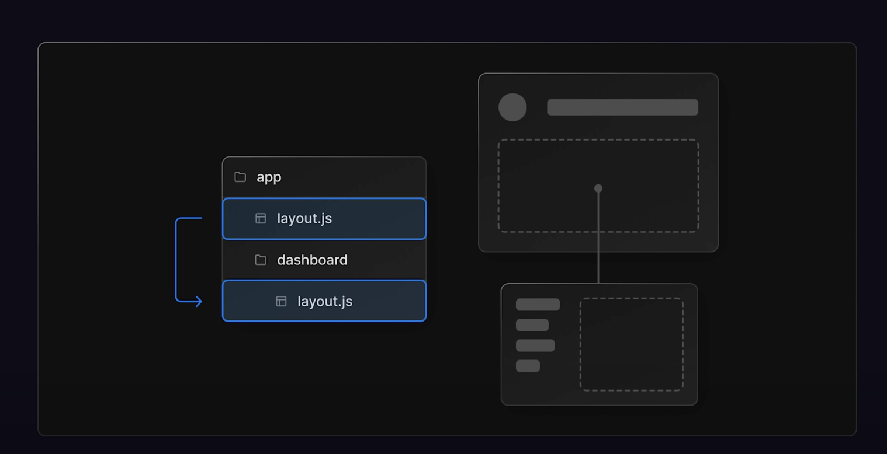

Next.js is a React Based framework with server side rendering capability. It is very fast and SEO friendly.

Using Next.js, you can create robust react based application quite easily and test them. Following are the key features of Next.js.

- Hot Code Reload − Next.js server detects modified files and reloads them automatically.

- Automatic Routing − No need to configure any url for routing. In the old app router, files are to be placed in pages folder. 
In the new app router, for each frontend route simply make a folder with the route name in the app directory containing page.tsx/jsx with the route UI logic, for backend routes simply create folders with the route name containing route.js/ts file with the backend logic. All urls will be mapped to file system. Customization can be done.

- Component specific styles − styled-jsx provides support for global as well as component specific styles. Via cardComponent.module.css naming convention.

- Server side rendering − by default next js components are server side renedered, this is great for faster performance and more search engine friendly applications, but it prevents interactivity in the component, for dynamic and interactive components make them client side, P.S. cleverly segregate the portion of logic whihc requires client interaction like clicks or somethign else into small client side component to benefit maximally from nextjs's ssr capabilities. react components are prerendered on server hence loads faster on client.

- Node Ecosystem − Next.js being react based blends well with Node ecosystem.

- Automatic code split − Next.js renders pages with the libraries they need. Instead of creating a single large javascript file/bundle, it creates multiples resources. When a page is loaded, only required javascript page is loaded with it.

- Prefetch − Next.js provides Link component which is used to link multiple components supports a prefetch property to prefetch page resources in background.

- Dynamic Components − Next.js allows to import JavaScript modules and React Components dynamically.

- Export Static Site − Next.js allows to export full static site from your web application.

- Built-in Typescript Support − Next.js is written in Typescripts and provides excellent Typescript support.

# nested layouts:
