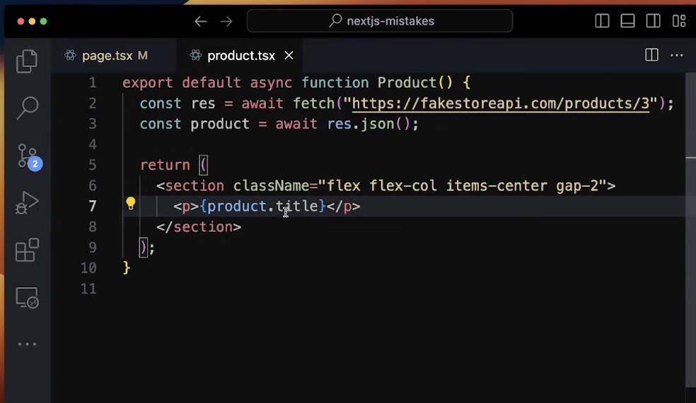
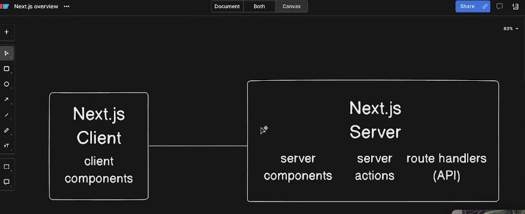
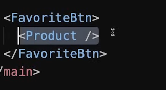

Next.js is a React Based framework with server side rendering capability. It is very fast and SEO friendly.

Using Next.js, you can create robust react based application quite easily and test them. Following are the key features of Next.js.

- Hot Code Reload − Next.js server detects modified files and reloads them automatically.

- Automatic Routing − No need to configure any url for routing. In the old app router, files are to be placed in pages folder. 
In the new app router, for each frontend route simply make a folder with the route name in the app directory containing page.tsx/jsx with the route UI logic, for backend routes simply create folders with the route name containing route.js/ts file with the backend logic. All urls will be mapped to file system. Customization can be done.

- Component specific styles − styled-jsx provides support for global as well as component specific styles. Via cardComponent.module.css naming convention.

- Server side rendering − by default next js components are server side renedered, this is great for faster performance and more search engine friendly applications, but it prevents interactivity in the component, for dynamic and interactive components make them client side, P.S. cleverly segregate the portion of logic whihc requires client interaction like clicks or somethign else into small client side component to benefit maximally from nextjs's ssr capabilities. react components are prerendered on server hence loads faster on client.

- Node Ecosystem − Next.js being react based blends well with Node ecosystem.

- Automatic code split − Next.js renders pages with the libraries they need. Instead of creating a single large javascript file/bundle, it creates multiples resources. When a page is loaded, only required javascript page is loaded with it.

- Prefetch − Next.js provides Link component which is used to link multiple components supports a prefetch property to prefetch page resources in background.

- Dynamic Components − Next.js allows to import JavaScript modules and React Components dynamically.

- Export Static Site − Next.js allows to export full static site from your web application.

- Built-in Typescript Support − Next.js is written in Typescripts and provides excellent Typescript support.

# nested layouts:

- you can also fetch data on layouts, which makes the app more efficient as you dont need to rerender and refetch data on the sub routes

## hydration in next.js
In Next.js, "hydration" refers to the process of converting a static HTML page generated on the server into a fully interactive React application in the browser.
When a Next.js page is rendered on the server, it sends back a fully formed HTML document to the client. This document is quickly displayed to the user, allowing for fast initial loading. However, to enable React's dynamic features (like state management and event handling), the React components need to "hydrate" the static HTML. This involves:

Attaching Event Listeners: React sets up the necessary event listeners so that user interactions (like clicks or inputs) can be handled.
Reconciliation: React reconciles any differences between the server-rendered content and the client-side component tree, ensuring that the UI behaves as expected.

# Next JS 29 mistakes
- in server components, you mark them as async and fetch some data without useEffect, directly above return statement, this won't work in a client component:

- next js arch.

# mistakes
## 1. using 'use client' too high up in the component tree.
- when you need to use any react hook, you need to make it a client component.
- we want to benefit from the default server components, whihc allow us to do async operations, work with large data on the server and only return the final result render, we dont want to do this computation on the client, so we minimize 'use client' to only those wich require client's interaction
- if you declare a comp as client, then everything imported inside it also becomes a client comp.
## 2. not refactoring for 'use client'
- basically isolate the code like a button which needs client
## 3. thinking a component is a server component because it does not have 'use client'

## 4. thinking that a server component becomes a client component if you wrap it inside a client comp.
- emphasis on `wrap` because we'r not importing it we're using it as a children and wrapping it in a context provider.
- when we pass a server component as a prop to a client comp. it will remain a server component, for example  and using the children prop
