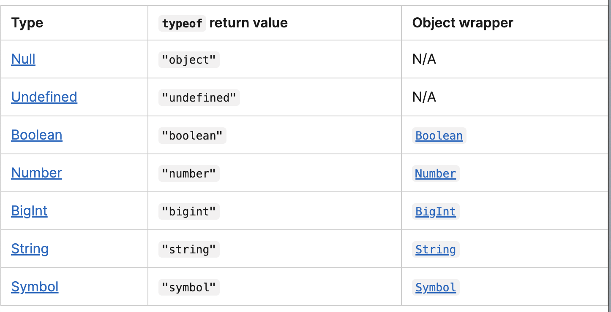

# Inheritance and the prototype chain
- JavaScript implements inheritance by using objects. Each object has an internal link to another object called its prototype.
- That prototype object has a prototype of its own, and so on until an object is reached with null as its prototype. By definition, null has no prototype and acts as the final link in this prototype chain. 
- Example:
```js
const o = {
  a: 1,
  b: 2,
  // __proto__ sets the [[Prototype]]. It's specified here
  // as another object literal.
  __proto__: {
    b: 3,
    c: 4,
  },
};

// o.[[Prototype]] has properties b and c.
// o.[[Prototype]].[[Prototype]] is Object.prototype (we will explain
// what that means later).
// Finally, o.[[Prototype]].[[Prototype]].[[Prototype]] is null.
// This is the end of the prototype chain, as null,
// by definition, has no [[Prototype]].
// Thus, the full prototype chain looks like:
// ⭐️ { a: 1, b: 2 } ---> { b: 3, c: 4 } ---> Object.prototype ---> null

console.log(o.a); // 1
// Is there an 'a' own property on o? Yes, and its value is 1.

console.log(o.b); // 2
// Is there a 'b' own property on o? Yes, and its value is 2.
// The prototype also has a 'b' property, but it's not visited.
// ⭐️ This is called Property Shadowing

console.log(o.c); // 4
// Is there a 'c' own property on o? No, check its prototype.
// Is there a 'c' own property on o.[[Prototype]]? Yes, its value is 4.

console.log(o.d); // undefined
// Is there a 'd' own property on o? No, check its prototype.
// Is there a 'd' own property on o.[[Prototype]]? No, check its prototype.
// o.[[Prototype]].[[Prototype]] is Object.prototype and
// there is no 'd' property by default, check its prototype.
// o.[[Prototype]].[[Prototype]].[[Prototype]] is null, stop searching,
// no property found, return undefined.
```
## Constructors and Constructor function:
consider this code:
```js
const boxPrototype = {
  getValue() {
    return this.value;
  },
};

const boxes = [
  { value: 1, __proto__: boxPrototype },
  { value: 2, __proto__: boxPrototype },
  { value: 3, __proto__: boxPrototype },
];
```
we can instead do:

```js
// A constructor function
function Box(value) {
  this.value = value;
}

// Properties all boxes created from the Box() constructor will have
Box.prototype.getValue = function () {
  return this.value;
};

const boxes = [new Box(1), new Box(2), new Box(3)];
```
> ⭐️ `Box.prototype` is not much different from the `boxPrototype` object we created previously — it's just a plain object.

- Every instance created from a constructor function will automatically have the constructor's prototype property as its [[Prototype]] — that is, Object.getPrototypeOf(new Box()) === Box.prototype.
- The above code can be written in class-syntax as:
```js
class Box {
  constructor(value) {
    this.value = value;
  }

  // Methods are created on Box.prototype
  getValue() {
    return this.value;
  }
}
```

- Let `Box` be the classname and `box` be the instance name then `Box.prototype` and `box.__proto__` point to the same memory loc, so we can alter the `Box` class through either of them and it affect all instances even after their initialization:
```js
function Box(value) {
    this.value = value;
  }
  Box.prototype.getValue = function () {
    return this.value;
  };
  const box = new Box(1);
  const box2 = new Box(4);
  
  // Mutate Box.prototype after an instance has already been created
  Box.prototype.getValue = function () {
    return this.value * 12;
  };
  box.__proto__.getValue = function () {
    return this.value * 120;
  };
  console.log(box.getValue());
  console.log(box2.getValue());
  ```
> and some obj literals automatically have a default prototype
```js
Object.getPrototypeOf(Box) === Function.prototype
// Object literals (without the `__proto__` key) automatically
// have `Object.prototype` as their `[[Prototype]]`
const object = { a: 1 };
Object.getPrototypeOf(object) === Object.prototype; // true

// Array literals automatically have `Array.prototype` as their `[[Prototype]]`
const array = [1, 2, 3];
Object.getPrototypeOf(array) === Array.prototype; // true

// RegExp literals automatically have `RegExp.prototype` as their `[[Prototype]]`
const regexp = /abc/;
Object.getPrototypeOf(regexp) === RegExp.prototype; // true\
```
> We can "de-sugar" them into their constructor form.
```js
const array = new Array(1, 2, 3);
const regexp = new RegExp("abc");
```
It may be interesting to note that due to historical reasons, some built-in constructors' prototype property are instances themselves. For example, Number.prototype is a number 0, Array.prototype is an empty array, and RegExp.prototype is /(?:)/.

```js
Number.prototype + 1; // 1
Array.prototype.map((x) => x + 1); // []
String.prototype + "a"; // "a"
RegExp.prototype.source; // "(?:)"
Function.prototype(); // Function.prototype is a no-op function by itself
```

# Optional chaining (?.)
The optional chaining (?.) operator accesses an object's property or calls a function. If the object accessed or function called using this operator is undefined or null, the expression short circuits and evaluates to undefined instead of throwing an error.


# JavaScript data types and data structures
- JavaScript is a dynamic language with dynamic types
- JavaScript is also a weakly typed language
## Primitive values
- All types except `Object` define immutable values represented directly at the lowest level of the language. We refer to values of these types as primitive values.
- All primitive types, except `null`, can be tested by the `typeof` operator. `typeof` `null` returns "object", so one has to use === `null` to test for `null`.
- All primitive types, except `null` and `undefined`, have their corresponding object wrapper types, which provide useful methods for working with the primitive values. For example, the Number object provides methods like toExponential().

<b><center>Object Wrapper Classes for Primitive Types</center></b>

- When a property is accessed on a primitive value, JavaScript automatically wraps the value into the corresponding wrapper object and accesses the property on the object instead.
- Conceptually, `undefined` indicates the absence of a value, while `null` indicates the absence of an object (which could also make up an excuse for `typeof` `null` === "object"). The language usually defaults to `undefined` when something is devoid of a value:
`null` is a keyword, but `undefined` is a normal identifier that happens to be a global property. In practice, the difference is minor, since `undefined` should not be redefined or shadowed. for exaxmple, this works just fine: 
```js
"use strict";
let undefined = 2;
console.log(undefined);
```
- `Nan` - is a special kind of number value that's typically encountered when the result of an arithmetic operation cannot be expressed as a number. It is also the only value in JavaScript that is not equal to itself.


## Objects
- In computer science, an object is a value in memory which is possibly referenced by an identifier. In JavaScript, objects are the only mutable values. Functions are, in fact, also objects with the additional capability of being callable.
- There are two types of object properties: The data property and the accessor property. 
    - Accessor property: Associates a key with one of two accessor functions (get and set) to retrieve or store a value.
    - Data properties associate a key with a value.


- Arrays are regular objects for which there is a particular relationship between integer-keyed properties and the length property. Additionally, arrays inherit from Array.prototype, which provides a handful of convenient methods to manipulate arrays.

## some points on type coercion:
- `+` operator - if any one operand is string, then string concat is performed.
    - ❗️ if there is any other operator which deals with the string then the string will convert to int.

## `Date`
- use: 
```js
const date = new Date();
date.getMonth();
date.getMinutes();
date.getFullYear();
```
```js
const ms = Date.now(); // total ms elapsed till now from a reference start data
```

## imp points:
- functions declared like this are hoisted to the top of its scope:
```js
console.log(f(3));

function f(x) {
    return x*x;
}
```